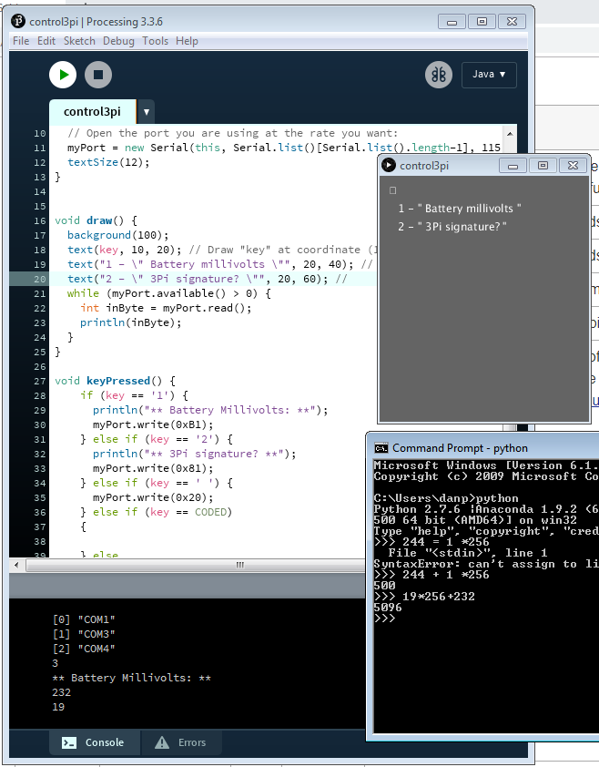
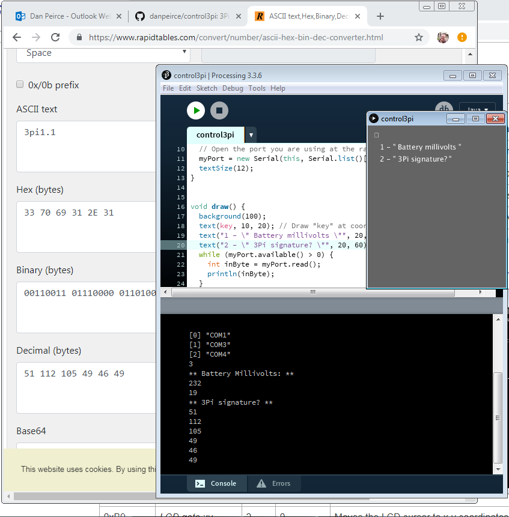

# Control 3Pi Robot

This processing code to be used to test control of a Pololu 3Pi robot.
It is assumed the robot is running the serial slave program from Pololu.
This will allow the 3Pi robot to be controlled from a PC.

* [10.a. Serial slave program](https://www.pololu.com/docs/0J21/all#10.a)

This image shows the 3Pi connected to a PC via a USB to serial adapter.

This is still in just a very early stage of development.

## Command Test Results

### Battery Voltage

A hex 0xB1 was sent to the 3Pi slave and the following was displayed in the Processing 
response window:

~~~~
** Battery Millivolts: **
232
19
~~~~

This can be interpreted by plugging the decimal values into an equation:

~~~~python
value1 = 232
value2 = 19
milivolts = value1 + value2 * 256
~~~~

### 3Pi Signature

The signature command was sent to the 3pi slave with the following response:

~~~~
** 3Pi signature? **
51
112
105
49
46
49
~~~~

The decimal values were then entered into a ascii converter web page to obtain the message as a string.

### Print APSC1299 in LCD

Sends message to LCD "APSC1299".

### Print KPU APSC1299 

Sends message to LCD " KPU APSC1299".

Notes
* clears screen first
* after " KPU" sent the cursor position is set to row 1 column 0.
* "APSC1299" set last

### Auto Calibrate

Robot spins left and right over line and sensors are calibrated.

### Line Position

The robot returns a number corresponding to the line position.
 
